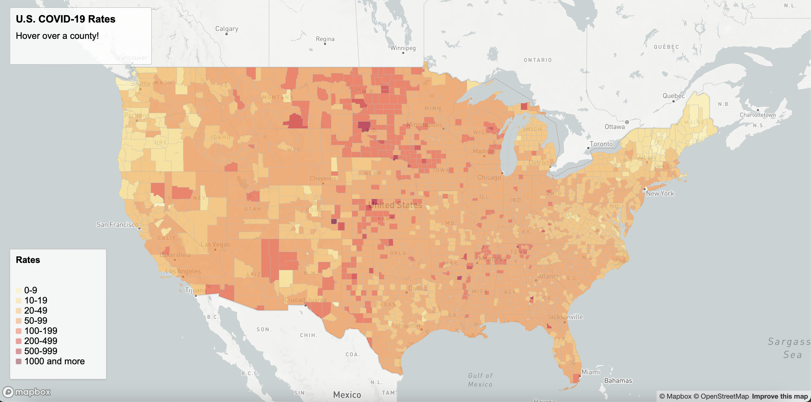
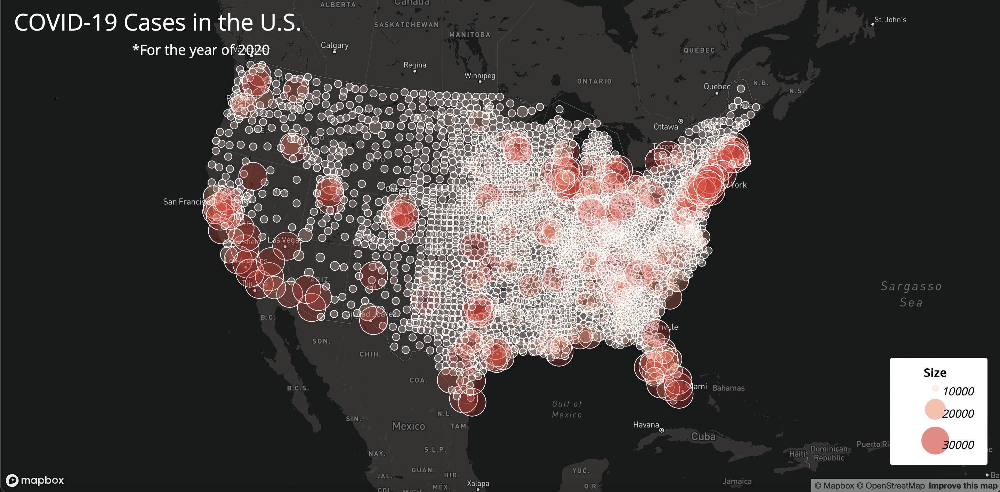

# U.S COVID-19 Rates and Cases
For this project, I created two maps to help showcase the impact that COVID-19 had on the United States in what is now considered the first year of the pandemic (the year 2020). These visualizations help to put into perspective what COVID-19 once meant to the United States and it can help us reflect on what it is today.

## Implementation
### 1. Choropleth Map
For the choropleth map, I made use of an internal CSS to implement the HTML elements such as title, description, and other features that helped to build the basis of the information I was trying to showcase. I also made use of JavaScript and the many different commands available such as the 'async function' for the creation of the map itself.

### 2. Proportional Symbol Map
When I worked on the proportional symbol map, I followed a similar outline to the one I used for the choropleth map since most of the syntax vas the same or very similar. However, implementing the data set was a little easier since it didn't require as many layers as the choropleth map.

### Data Acknowledgment
The data used for this project was obtained from the GEOG 458 course repo and was properly converted into a geojson file using the mapshaper online tool.

## Maps
### Map 1 - U.S. COVID-19 Rates at County Level

[Map 1 - Link](https://raw.githack.com/sergiov11/U.S-Covid19-Representation/main/map1.html)

### Map 2 - Number of COVID-19 Cases in the U.S.

[Map 2 - Link](https://raw.githack.com/sergiov11/U.S-Covid19-Representation/main/map2.html)
